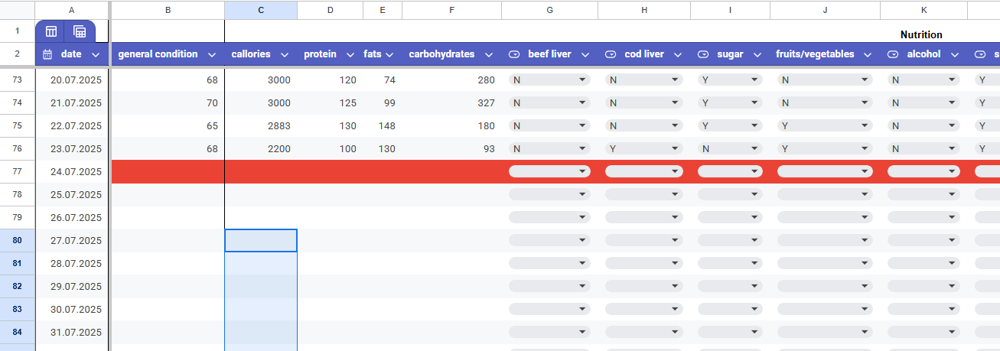
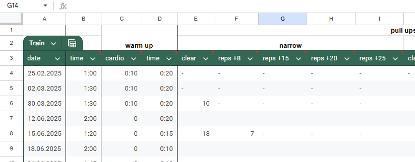
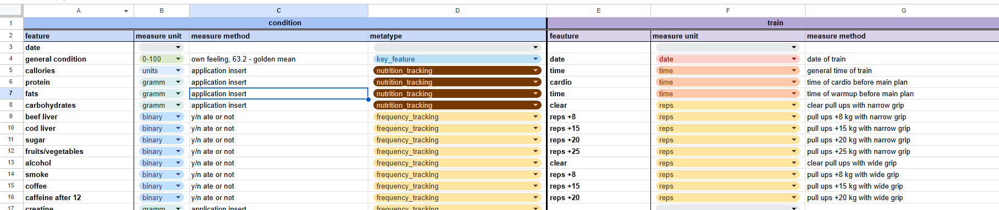
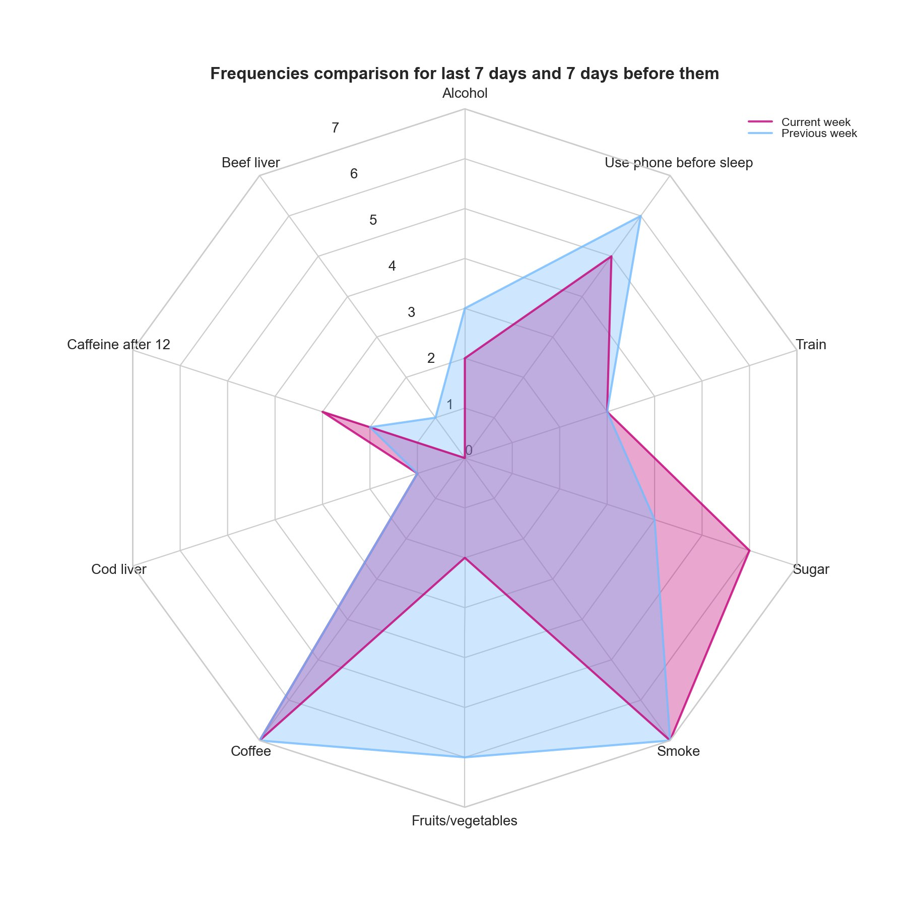
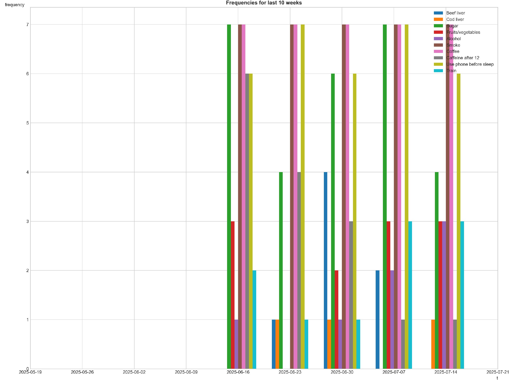
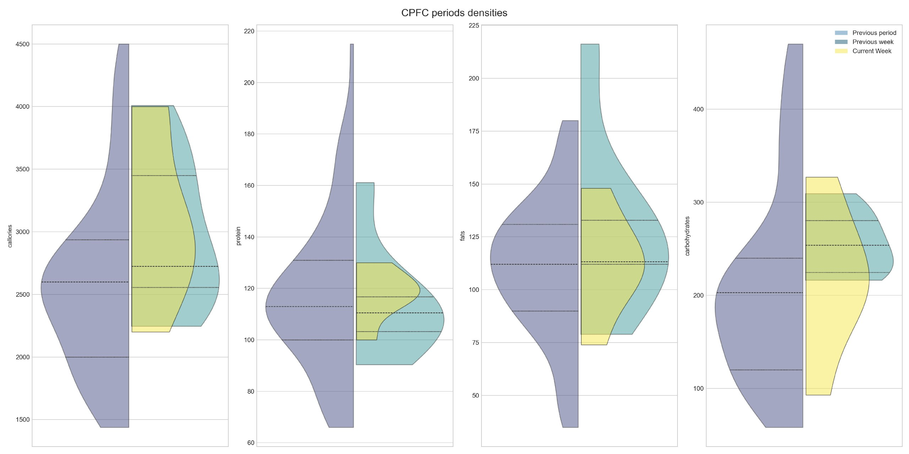
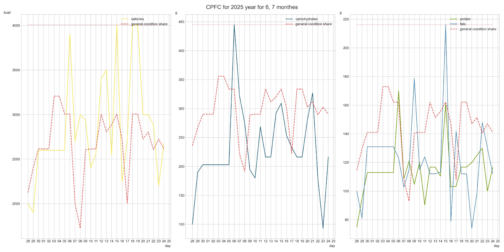

> Attempt to create general approach to analyse some considered important life features, habbits, frequencies _etc._

Given realization at this moment has following realized systems:
- habbits (frequencies feautures) tracking;
- callories, proteins, fats and carbohydrates (CPFC) tracking.

First one suggests general approach to track desired frequency values (_frequency_ in the sense that you have done it today or not); it allows to add new tracking features freely. Lattest does not give so general approach due to complicated implementation and these parameters often considered together also (and not idea what could be added to them).

# 1. View of Master Table

> The master table that contains all data is need to have specific attributive composition to work properly.

__Required structure:__
- _condtition_ sheet that contains following attributs (shifted rows with names in the beginning are required — 2 rows, second one with attribute names):
    
    - date;
    - for most functions callories, protein, fats, carbohydrates and frequencies attributes (about that later) must be reflected in table;
    - other attributes (which are described in according functions);
- _trainings_ sheet
    
    - date;
    - other attributes;
- _expenses_ and _incomes_ that contains name column names in first row in following order:
    - date "DD/MM/YYYY";
    - category (food, cafe, _etc._);
    - amount (money spent, comma or dot separated);
    - currency (not in use yet, but comming soon :);
    - comment (not in use yet, but comming soon :);
- _manual condition_ contains information that describes attributes from other sheets (works properly works with only condition sheet now), starts with second row:
    
    - first block (condition, 4 columns):
        - feature — the exact name of the columns from condition sheet;
        - measure unit (used only inside table);
        - measure method (used only inside table);
        - metatype — attribute that describes attribute from condition sheet, needed for sort in visualization.


> The most names of attributes and their existance could may be seemed illogical and redundant, but the reason for that, that such a structure is a result of many attempt to create the system to be easy filled during day, and it was not carefully designed before use, it was finalized in the process.

# 2. Visualizations

The idea of visualizations is not to make deep conclusions from the plots, however, to make a fast look in time periods and make a conclusion what I am doing right or wriong right now. Despite "CPFC_linear" plot tries to mannipulate with general condition feauture but it is complicated to make deep conclusions from that (due different reasons).

## 2.1. Before Start

Before you start, it is important to explain instruction for a quick dive. `src/main.py` shows how it could be easily started, but some moments is need to be explained.

1. _Command arguments_ must be entered in following order: bot_token chat_id path_to_scenario plot_or_union_1 plot_or_union_2 ...

2. _Scenario_ has a following idea: for example it is required sometimes to launch expenses with different time periods or you want to show linear for CPFC with different grannulation on different days, so _scenarios_ are created for this purpose (reserve for orchestration or planning in future).


## 2.2. Frequencies Features Tracking

### Spider Plot

The idea of the plot is to track what I should do on these week and what I should slow down. Fast look — fast conclusion.



### Linear Plot

A similar idea with spider plot.



## 2.3. CPFC

### Violin Plot

The idea to compare general trend with trends of last two weeks. Fast look — fast conclusion.

The following message with plot is formed:

```AVG magnitudes*:
    🟩 callories=3108.8 (+474.2)
    🟩 protein=117.9 (+1.2)
    🟩 fats=112.5 (+0.4)
    🟩 carbohydrates=218.4 (+2.3)

🟥 — changes are significant on 1% level of confidence
🟨 — changes are significant on 5% level of confidence
🟩 — changes are not significant

* changes are shown relative to the mean of previous weeks.
```

For significance defining t-test was used, values of current week and all previous time were compared.



### Linear CPFC

I think there is no requirence to explain the idea.




# 3. Analysis

It turns out that any analysis is really complicated. It could be related with such a _unclear_ key feature as _general condition_.

The results of correlations also unsatisfactory, variables shows it really low.